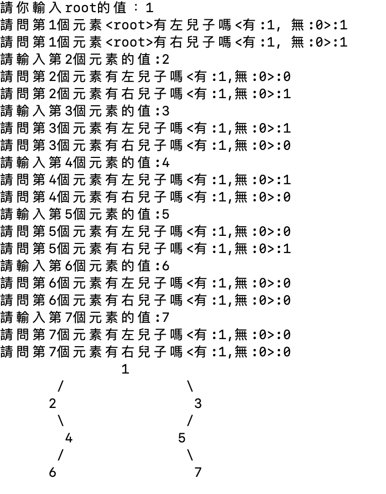

# 關於這支程式
這是一支可以用來建立Binary Tree並且將它視覺化的程式。 
這裡會由下面的子標題依序來介紹這支程式是如何撰寫的。若要更清楚地閱讀markdown language可以開啟vscode，並且啟用[privew markdown的功能](https://code.visualstudio.com/docs/languages/markdown#_extending-the-markdown-preview)。

- [關於這支程式](#關於這支程式)
  - [結構](#結構)
  - [建造二元樹](#建造二元樹)
  - [視覺化](#視覺化)
  - [Make 使用與程式執行](#make-使用與程式執行)
  - [範例執行結果](#範例執行結果)
  - [未來可以修正的部分](#未來可以修正的部分)

## 結構
           +----------------+
           |   main.cpp     |
           +----------------+
                 |
                 | includes
                 v
           +----------------+
           |   traverse.h   |
           +----------------+
                 |
                 | includes
                 v
           +----------------+
           |  treeNode.h    |
           +----------------+

- 總共有三個檔案並且關係如圖所示，其中treeNode.h包含了一顆二元樹節點該有的屬性以及如何取得這些屬性的成員函數。
- 我們會在main.cpp中去利用二元樹的節點去建構出一顆二元樹。要建構二元樹會使用到的一些成員函數我們在一邊撰寫main.cpp時一邊撰寫出我們需要的函數。利用類似"TDD"的開發模式。例如：要索取左子樹時我們會在main中先寫出ptr->getLeftChild()，才會去二元樹節點的類別中完成這個函式。
- traverse.h中會有函數來拜訪已經建立好的二元樹，並且將他們存到二維陣列。最後將整顆二元樹印出來。因為不管是traverse或是main都需要使用到treeNode，而main又會使用到traverse中的函數，所以我們才會看到圖中的結構。
  
## 建造二元樹
我們會在main.cpp中建造二元樹。建造的方法是先將ROOT放到一個Queue中。並開始進行廣度優先搜尋(BFS)。將樹節點從Queue中pop出來後會根據使用者來決定有沒有左右子樹，如果有的話就將這些子樹放入到Queue中。

## 視覺化
我們想要將建立出來的二元樹印出來。所以我們要去拜訪這個二元樹，並且將節點的值還有對應的樹枝都存放到一個二元陣列的對應的cell中。
- 為了初始化一個二元陣列，我們需要知道他的ROW和COLUMN要設定為多少。
  -  所以我們要先去找出這顆二元樹的高度。利用深度優先搜尋(DFS)可以很容易的找出高度。
-  為了盡量不讓左右子樹重疊，我們讓ROOT的值保存在陣列的第一列的中間，然後將左樹枝和右樹枝都離ROOT $2^{h-1}$的距離，其中h為樹高。
-  之後我們利用BFS再次的拜訪整棵二元樹，這次我們要存放到Queue中的會是(x座標, y座標, treeNode)，所以會使用一個Node物件來代表這個tuple，存放座標可以讓我們知道如果這個treeNode有左子樹或右子樹時要存在陣列的哪個cell中。

## Make 使用與程式執行
1. 這支程式中的bin目錄已經有可執行檔。直接輸入`bin/executable`即可執行程式。
2. 也可以利用`make clean`刪除可執行欓並且重新以`make run`編譯並且執行。

## 範例執行結果

## 未來可以修正的部分
這支程式還有很多需要加強和修改的部分。
- 防呆機制：如果輸入非整數則會錯誤。
- 只能印出高度最多為3的完滿樹，之後會因為分配的二維陣列不夠長導致錯誤。